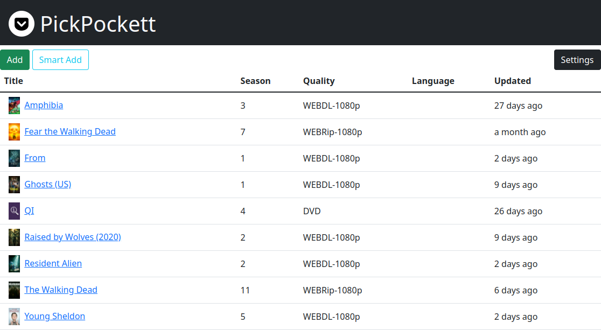

# PickPockett

PickPockett watches a series page on a torrent tracker for magnet link updates.
It works as an indexer for [Sonarr](https://github.com/Sonarr/Sonarr) and allows grabbing newly aired episodes.

## Start using command line

### Install

It's recommended to use Python virtual environment to run PickPockett

```
python3 -m venv venv
source venv/bin/activate
pip install -r requirements.txt
```

### Run

```
python3 -m pickpockett
```

and point your browser to

```
http://localhost:9119
```

### Start using Docker:

```
docker run -d -p 9119:9119 pickpockett/pickpockett
```

### docker-compose.yml:

```
version: "2.1"
services:
  pickpockett:
    image: pickpockett/pickpockett
    ports:
      - "9119:9119"
    volumes:
      - pickpockett:/data
volumes:
  pickpockett:
```

## Settings

On the first start PickPockett asks for Sonarr configuration.
Optionally, you can setup [FlareSolverr](https://github.com/FlareSolverr/FlareSolverr).

## Screenshot


